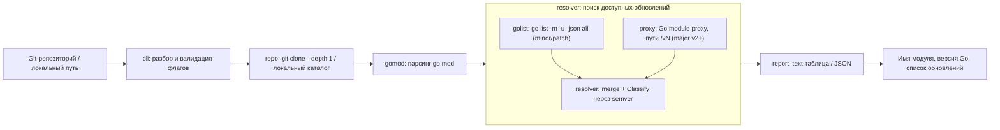

# goupd

CLI, которая для указанного Git-репозитория выводит данные о Go-модуле и список зависимостей, доступных для обновления.

На вход подаётся адрес Git-репозитория (или путь к локальному каталогу), на выходе — имя модуля, версия Go и список зависимостей, которые можно обновить (включая мажорные версии v2+).

## Установка

Требуется установленный Go (>= 1.22) и `git` в `PATH`.

```bash
go build -o goupd ./cmd/goupd
```

## Использование

```bash
goupd [flags] <git-repo-url|local-path>
```

Примеры:

```bash
goupd https://github.com/foo

goupd --ref v1.4.0 https://github.com/foo

goupd --format json --direct-only https://github.com/foo

goupd ./path/to/module
```

### Флаги

| Флаг            | По умолчанию | Описание                                                        |
| --------------- | ------------ | --------------------------------------------------------------- |
| `--ref`         | (default)    | Ветка, тег или коммит для checkout                              |
| `--format`      | `text`       | Формат вывода: `text` или `json`                                |
| `--major`       | `true`       | Искать мажорные (v2+) обновления через Go module proxy          |
| `--direct-only` | `false`      | Показывать только прямые зависимости                            |
| `--timeout`     | `2m`         | Общий таймаут на сетевые операции                               |

## Как это работает

1. Репозиторий клонируется (`git clone --depth 1`) во временный каталог; локальный путь используется напрямую.
2. `go.mod` парсится через `golang.org/x/mod/modfile` — извлекаются имя модуля, версия Go и список зависимостей.
3. Обновления в рамках текущего мажора берутся из `go list -m -u -json all`.
4. Мажорные обновления (v2+) обнаруживаются отдельно: для каждой прямой зависимости опрашивается Go module proxy по путям `path/vN`, поскольку `go list` такие апдейты не возвращает (меняется путь модуля).
5. Версии сравниваются и классифицируются (`patch` / `minor` / `major`) через `golang.org/x/mod/semver`.

## Пример вывода

```
Module:  github.com/acme/foo
Go:      1.22

DEPENDENCY                   CURRENT   LATEST    TYPE
github.com/pkg/errors        v0.9.0    v0.9.1    patch
github.com/spf13/cobra       v1.7.0    v1.8.1    minor
github.com/redis/go-redis    v6.15.9   v9.5.1    major (-> github.com/redis/go-redis/v9)
```

## Архитектура

Приложение построено как линейный конвейер: точка входа `cmd/goupd` оркеструет вызовы независимых пакетов из `internal/`, передавая результат каждого шага следующему.



### Пакеты и зоны ответственности

| Пакет | Файлы | Ответственность |
| --- | --- | --- |
| `cmd/goupd` | `main.go` | Точка входа. Оркеструет весь конвейер (`run`), обрабатывает ошибки и код возврата, выбирает формат вывода. |
| `internal/cli` | `cli.go` | Разбор и валидация аргументов и флагов командной строки в структуру `Config`. |
| `internal/repo` | `repo.go` | Получение исходников: `git clone --depth 1` во временный каталог (или прямое использование локального пути) и возврат функции очистки. |
| `internal/gomod` | `gomod.go` | Парсинг `go.mod` через `golang.org/x/mod/modfile` в структуру `Module` (путь модуля, версия Go, `require`, `replace`). |
| `internal/resolver` | `golist.go`, `proxy.go`, `resolver.go` | Определение доступных обновлений. `golist` — обёртка над `go list -m -u -json all` (обновления в рамках текущего мажора); `proxy` — пробинг Go module proxy по путям `path/vN` для мажорных версий; `resolver` — слияние результатов и классификация (`patch`/`minor`/`major`) через `golang.org/x/mod/semver` в `[]Update`. |
| `internal/report` | `report.go` | Рендеринг итогового отчёта (`Report`) в человекочитаемую таблицу или JSON. |

### Принципы

- Пакеты в `internal/` не зависят друг от друга (кроме `report`, который импортирует тип `Update` из `resolver`); связывает их только `cmd/goupd`.
- Каждый шаг конвейера имеет узкий публичный интерфейс (`Parse`, `Clone`, `Resolve`, `WriteText`/`WriteJSON`), что упрощает тестирование в изоляции.
- Сетевые сбои при пробинге мажорных версий не фатальны — они просто не добавляют мажорный апдейт в результат.


## Тесты

```bash
go test ./...
```

## Разработка

В репозитории есть `Makefile` с типовыми целями:

```bash
make build      # собрать бинарь goupd
make test       # go test -race -cover ./...
make fmt        # отформатировать код (gofmt)
make fmt-check  # проверить форматирование без изменений
make vet        # go vet ./...
make lint       # golangci-lint run (нужен golangci-lint)
make tidy       # go mod tidy
make all        # fmt + vet + test + build
```

Дополнительно настроены:

- `.golangci.yml` — конфигурация `golangci-lint` (линтеры + форматтеры `gofmt`/`goimports`).
- `.editorconfig` — единый стиль отступов и окончаний строк.
- `.github/workflows/ci.yml` — CI: проверка `gofmt`, `go vet`, тесты с `-race` и линт на каждый push/PR.
- `.github/dependabot.yml` — автообновление зависимостей Go и GitHub Actions.
